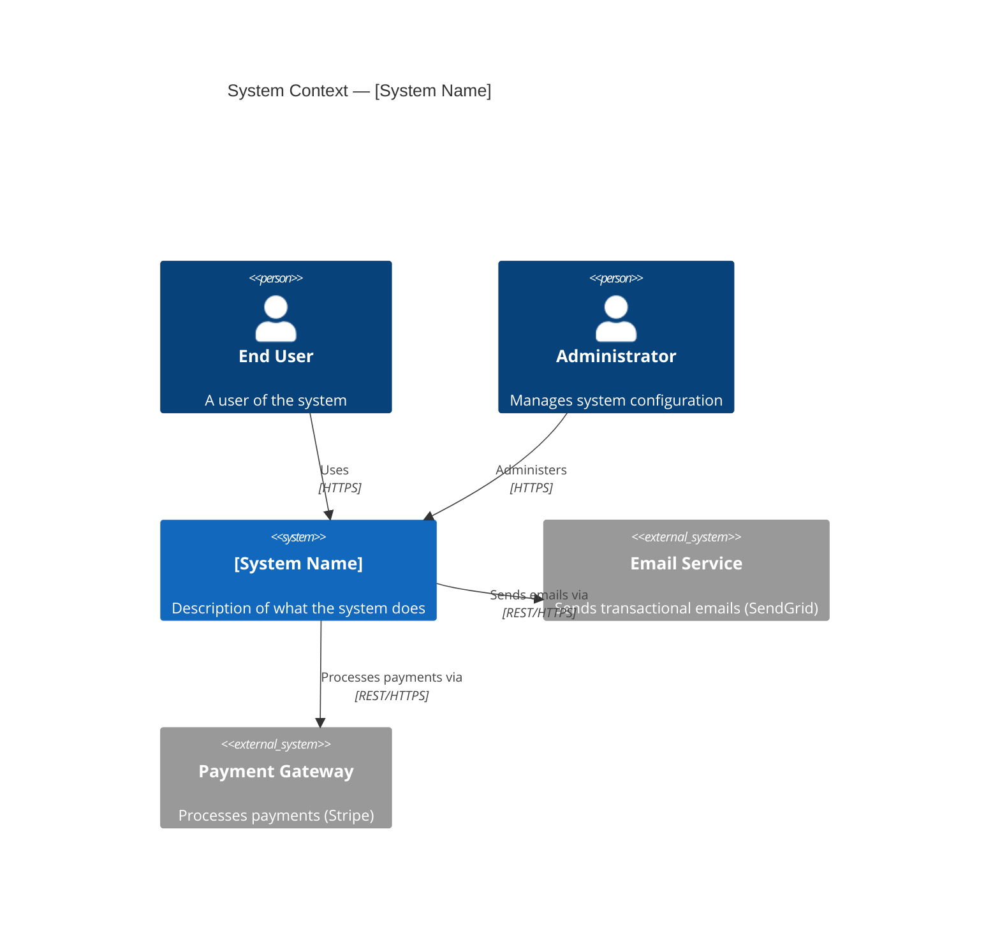
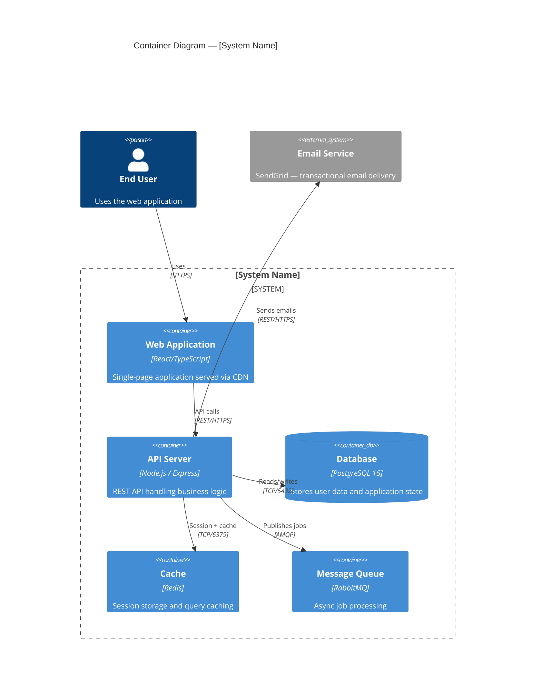
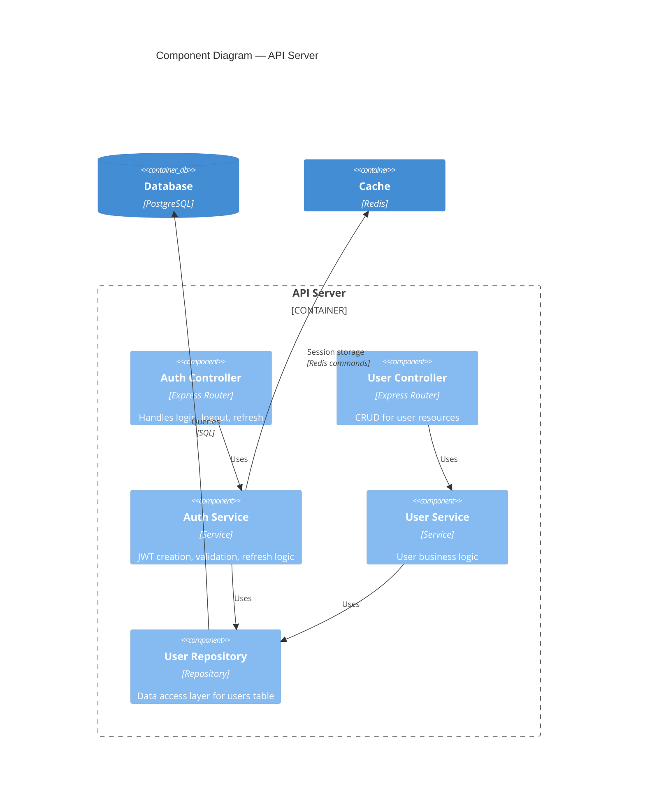

# diagram-c4

Produce **C4 model diagrams** at the appropriate level(s) using Mermaid syntax (default) or PlantUML C4 macros.

## What is C4?

C4 is a hierarchical diagramming model that zooms into a system at four levels:

| Level | Audience | Shows |
|-------|----------|-------|
| **L1 Context** | Everyone | System + external users and systems it interacts with |
| **L2 Container** | Developers | Applications, databases, services inside the system |
| **L3 Component** | Developers | Internal structure of a single container |
| **L4 Code** | Implementers | Classes, functions — rarely needed, auto-generated from code is better |

## What level to produce

- If the user asks for "a C4 diagram" without specifying: produce L1 + L2
- If the user asks for a "component diagram" or mentions a specific service: produce L3 for that service
- If the user asks for "context diagram" or "system context": produce L1
- Produce all levels only when explicitly requested or when the system is well-defined and small

## Information gathering

From context, identify:
- **What system** is being diagrammed?
- **Who are the users** (personas)?
- **What external systems** does it interact with?
- **What are the main containers** (web app, API, database, queue, etc.)?
- **What level** is needed?

Work with what's provided. Infer reasonable containers/components from the tech stack if not specified.

## Output format

Always output:
1. A brief narrative explaining the diagram(s)
2. The Mermaid code block(s) that renders the diagram
3. A legend or notes if the diagram has non-obvious elements

### Mermaid C4 syntax

Use the official Mermaid C4 diagrams (available in Mermaid v10+):

```markdown
# C4 Context Diagram: [System Name]

[Brief description of what this diagram shows]



# C4 Container Diagram: [System Name]


```

### L3 Component diagram example



## Diagram quality checklist

Before finalizing each diagram:
- [ ] Every element has a name, technology/type, and description
- [ ] Relationships have labels describing what is communicated and with what protocol
- [ ] The boundary of the system is clear (what's inside vs outside)
- [ ] No more than 7±2 elements at any level (split into multiple diagrams if needed)
- [ ] External systems are clearly distinguished from internal containers
- [ ] Data flows are directed (arrows show who calls whom)

## Alternative: PlantUML C4

If the user prefers PlantUML, use the C4-PlantUML macros:

```plantuml
!include https://raw.githubusercontent.com/plantuml-stdlib/C4-PlantUML/master/C4_Context.puml

Person(user, "End User", "Uses the system")
System(mySystem, "My System", "Does important things")
System_Ext(ext, "External System", "Third-party dependency")

Rel(user, mySystem, "Uses")
Rel(mySystem, ext, "Calls")
```

## Calibration

- **Simple system description**: Generate L1 + L2
- **Explicit "component diagram"**: Generate L3 for named service
- **Large system**: Split into multiple L2 diagrams grouped by domain
- **Existing codebase context**: Infer containers from file structure, frameworks, and imports visible in context
