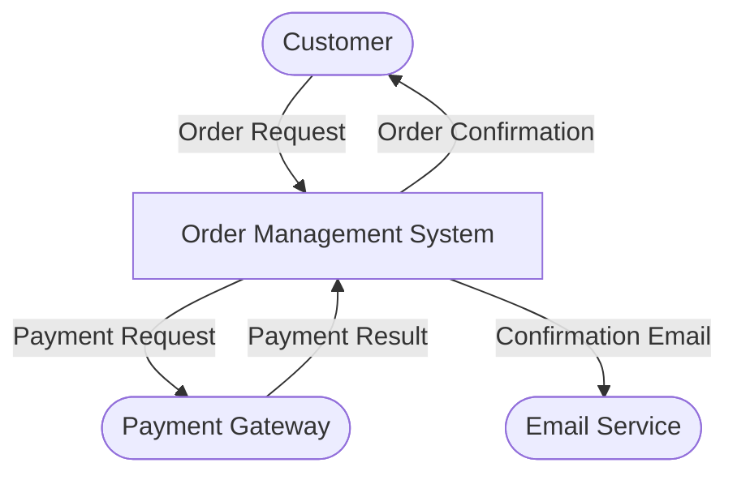
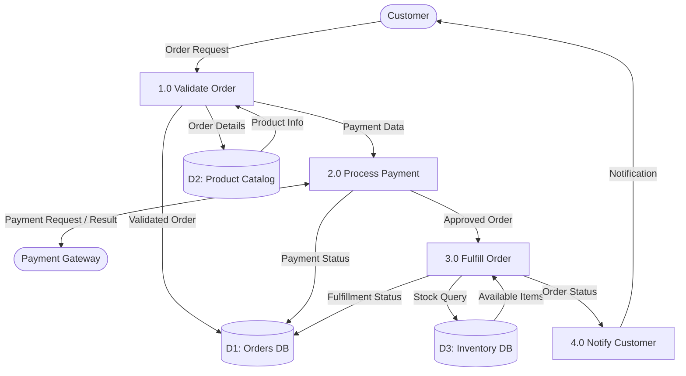
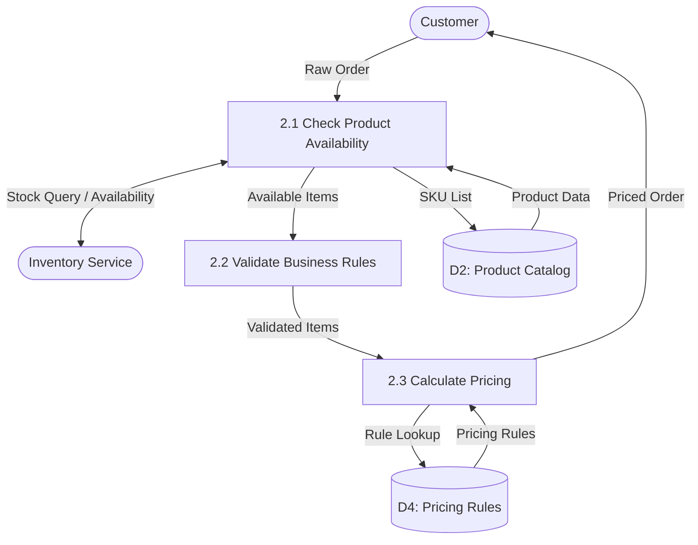

# diagram-dfd

Produce a **data flow diagram (DFD)** that shows how data moves through a system across context, process, and detail levels.

## DFD Levels

| Level | Scope | Shows |
|-------|-------|-------|
| **L0 — Context** | Entire system as a single process | External entities (actors), system boundary, major data flows in/out |
| **L1 — System** | Top-level decomposition | Main processes (3–7), data stores, flows between them and external entities |
| **L2 — Process** | One process from L1 expanded | Sub-processes, detailed data stores, specific data elements |

Generate the level(s) the user requests. If unclear, generate L0 and L1.

## DFD Notation

| Element | Symbol | Description |
|---------|--------|-------------|
| **Process** | Circle / rounded box | Transforms data (verb phrase: "Validate Payment") |
| **External Entity** | Rectangle | Actors outside the system boundary (users, systems) |
| **Data Store** | Open-ended rectangle (D1 label) | Persisted data (databases, files, queues) |
| **Data Flow** | Labeled arrow | Data moving between elements (noun phrase: "Order Details") |

Rules:
- Data flows connect processes to entities, stores, or other processes — **never entity-to-entity or store-to-store directly**
- Every process must have at least one input and one output flow
- Label all flows with the data they carry
- Use verb phrases for processes, noun phrases for flows

## Information gathering

From context, identify:
- **System scope**: What system or feature is being modeled?
- **External entities**: Who/what interacts with the system from outside?
- **Key processes**: What are the main data transformation steps?
- **Data stores**: What data is persisted and where?
- **Target level**: L0, L1, L2, or all?

## Output format

Use Mermaid flowchart syntax (renders in GitHub, Notion, most markdown viewers).

### L0 — Context Diagram



### L1 — System Diagram



### L2 — Process Detail

Show one process from L1 decomposed:



## Alternative: Structured Text Format

When Mermaid isn't suitable, produce a structured text DFD:

```
[L0 Context Diagram: Order Management System]

External Entities:
  - Customer (actor)
  - Payment Gateway (external system)
  - Email Service (external system)

System Boundary: Order Management System

Data Flows:
  Customer → [System]: Order Request {product_id, quantity, payment_details}
  [System] → Customer: Order Confirmation {order_id, status, estimated_delivery}
  [System] → Payment Gateway: Payment Request {amount, card_token, order_id}
  Payment Gateway → [System]: Payment Result {success, transaction_id, error_code?}
```

## Quality checklist

Before finalizing, verify:
- [ ] Every process has ≥1 input and ≥1 output flow
- [ ] No direct entity-to-entity or store-to-store flows
- [ ] All flows are labeled with data names (nouns)
- [ ] All processes are labeled with actions (verbs)
- [ ] Data stores use D1, D2 etc. identifiers consistently across levels
- [ ] L1 processes are numbered (1.0, 2.0...) so they trace to L2

## Calibration

- **L0 only**: Simple, 1 page — good for executive overview or kickoff documentation
- **L1 only**: Most common request — shows main processes without getting into detail
- **L1 + L2 for one process**: When a specific subprocess needs deep analysis
- **Full L0+L1+L2**: Comprehensive system documentation; produce as separate diagrams
