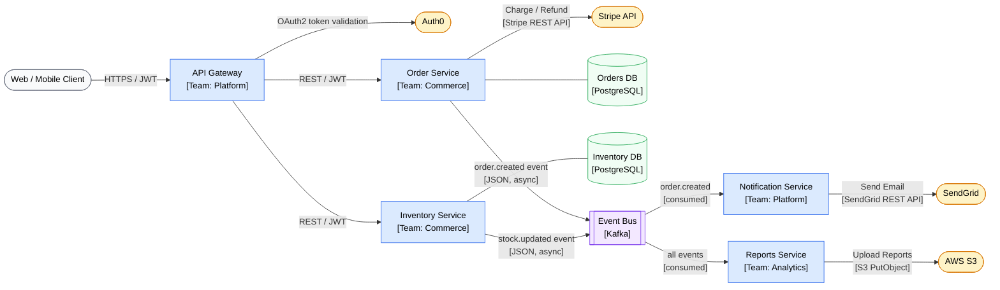

# diagram-integration

Produce an **integration map** showing how systems connect — their boundaries, APIs, data exchanges, protocols, and ownership.

## What makes a great integration diagram

The most useful integration diagrams answer: who calls whom, with what protocol, carrying what data, and who owns each system. They're used during incident response, onboarding, and architecture reviews. Focus on the connections that matter — not every internal function call, but service-to-service and system-to-external boundaries.

## Information gathering

From context, identify:
- **Systems/services**: What services, databases, third-party APIs, and external systems are involved?
- **Integration points**: What calls what? Which direction? Sync or async?
- **Protocols**: REST, gRPC, GraphQL, message queue, webhook, file transfer, etc.
- **Data exchanged**: What data crosses each boundary?
- **Ownership**: Which team owns each system?
- **Scope**: Specific feature, all integrations for a service, or entire landscape?

## Integration patterns to identify

| Pattern | Visual cue | Description |
|---------|-----------|-------------|
| **Sync API call** | Solid arrow → | REST/gRPC; caller waits for response |
| **Async message** | Dashed arrow → | Queue/event bus; fire and forget |
| **Webhook** | Solid arrow, reversed | External system pushes to your endpoint |
| **Polling** | Arrow with loop | Caller periodically checks for updates |
| **File/Batch** | Arrow with document icon | Scheduled file transfers |
| **Shared DB** | Both pointing to DB | Anti-pattern — note if present |

## Output format — Mermaid



## Integration Inventory Table

Always accompany the diagram with a table:

```markdown
## Integration Inventory

| From | To | Protocol | Data | Direction | SLA / Notes |
|------|----|----------|------|-----------|-------------|
| API Gateway | Order Service | REST over HTTPS | Order CRUD, JWT auth | Sync | < 200ms p95 |
| API Gateway | Auth0 | OAuth2 token validation | JWT | Sync | Called on every request |
| Order Service | Stripe | REST (Stripe SDK) | Payment intent, amount, currency | Sync | Idempotency key required |
| Order Service | Kafka | Produce | `order.created` event (JSON) | Async | At-least-once delivery |
| Notification Service | Kafka | Consume | `order.created` | Async | DLQ after 3 retries |
| Notification Service | SendGrid | REST | Email body, recipient, template ID | Async | Rate limit: 100/sec |
| Reports Service | AWS S3 | AWS SDK | Parquet files | Async (nightly) | Bucket: reports-prod |

## Third-Party Dependencies

| System | Owner | Auth Method | Rate Limits | Fallback |
|--------|-------|-------------|-------------|----------|
| Stripe | Finance team | API key (secret) | 100 req/s | Retry with backoff; fail open for non-payment flows |
| Auth0 | Platform team | OAuth2 client credentials | 1000 req/min | Cache tokens; fail closed |
| SendGrid | Platform team | API key | 100 emails/s | Queue in Redis; retry |
| AWS S3 | DevOps | IAM role | No hard limit | Local file fallback |
```

## Ownership & Contact Map

```markdown
## System Ownership

| System | Team | Slack Channel | On-call |
|--------|------|--------------|---------|
| Order Service | Commerce | #team-commerce | PagerDuty: commerce-oncall |
| Inventory Service | Commerce | #team-commerce | PagerDuty: commerce-oncall |
| Notification Service | Platform | #team-platform | PagerDuty: platform-oncall |
| API Gateway | Platform | #team-platform | PagerDuty: platform-oncall |
```

## Integration Risk Assessment

```markdown
## Risk Notes

| Integration | Risk | Mitigation |
|-------------|------|------------|
| Order Service → Stripe | External dependency; Stripe outage = no payments | Circuit breaker + retry; monitor Stripe status page |
| Shared Orders DB | Schema changes break multiple consumers | Strict migration policy; backward-compatible changes only |
| Kafka event bus | Consumer lag = delayed notifications | Alert on consumer lag > 1000 messages |
```

## Calibration

- **Single service integration map**: Show only the integrations of one service to everything it touches
- **Third-party dependencies only**: Focus table on external systems, auth, rate limits, fallbacks
- **Event-driven architecture**: Emphasize producer/consumer relationships, event schemas, topics
- **Legacy integration landscape**: Show anti-patterns (shared DB, synchronous chains) with risk notes
- **New feature impact**: Show which existing integrations a new feature will touch or need
