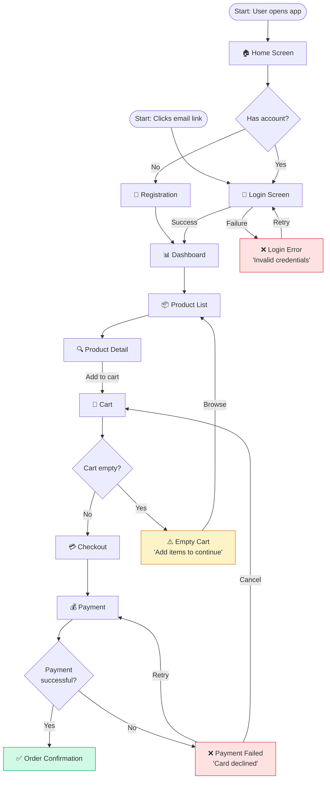
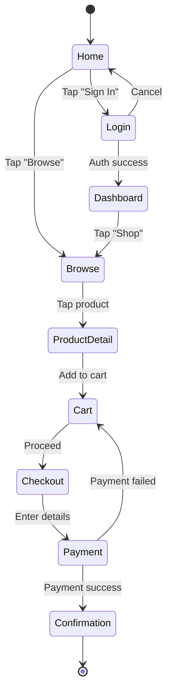

# diagram-ux-flow

Produce **user flow diagrams and journey maps** that visualize how users move through a product.

## Flow types

| Type | Best for | Output |
|------|----------|--------|
| **Task Flow** | Single task from entry to completion | Linear or branching flowchart |
| **User Flow** | Multiple entry points, decision points, and outcomes | Full flowchart with decisions |
| **Journey Map** | Emotional arc, touchpoints, pain points across a longer experience | Table + narrative |
| **Screen Flow** | Screen-by-screen navigation with transitions | Sequence of screens with arrows |

Generate the type the user requests. Default to User Flow if unclear.

## Information gathering

From context, identify:
- **Feature/task**: What is the user trying to accomplish?
- **User type**: Persona or role (first-time user, admin, returning customer)?
- **Entry points**: Where do users start? (Home, email link, direct URL, notification?)
- **Key decisions**: What choices do users make that branch the flow?
- **Success state**: What does task completion look like?
- **Error states**: What happens when something fails?

## Output format — Mermaid Flowchart

### User / Task Flow



### Screen Flow (Sequence style)



## Journey Map format (when requested)

```markdown
## User Journey Map: [Feature Name]

**Persona:** [User type — e.g., "First-time buyer"]
**Goal:** [What they're trying to accomplish]
**Scenario:** [Context — e.g., "User receives a promotional email and wants to buy a product"]

---

| Phase | Action | Touchpoint | Thoughts / Feelings | Pain Points | Opportunities |
|-------|--------|-----------|---------------------|-------------|---------------|
| **Awareness** | Receives email | Email | "Oh, this looks interesting" | Email looks like spam | Better subject line; personalization |
| **Arrival** | Clicks link → Landing page | Web | "Where do I even start?" | Page is overwhelming | Clear CTA, guided onboarding |
| **Discovery** | Browses products | Product list | "I can't find what I want" | Poor search/filter | Improve search; add facets |
| **Consideration** | Views product detail | Product page | "Is this the right one?" | No reviews, unclear specs | Add reviews; comparison feature |
| **Decision** | Adds to cart | Cart | "Okay, let's do this" | Unexpected shipping cost | Show shipping cost earlier |
| **Purchase** | Completes checkout | Checkout | "This is taking forever" | Too many form fields | Guest checkout; autofill |
| **Post-purchase** | Receives confirmation | Email | "Did it actually work?" | No tracking info | Real-time order tracking |

**Emotional Arc:**
😐 → 🤔 → 😕 → 😕 → 😒 → 😤 → 😊

**Top 3 Pain Points:**
1. [Most impactful pain point]
2. [Second pain point]
3. [Third pain point]

**Top 3 Opportunities:**
1. [Highest impact improvement]
2. [Second improvement]
3. [Third improvement]
```

## Annotation guidelines

Add these to flows as needed:
- **Decisions**: Use diamond shapes `{question}` — always labeled with both Yes/No paths
- **Error states**: Use `❌` prefix and red styling — always show recovery path
- **External systems**: Use `([rounded])` shape — indicates system boundary crossing
- **Success states**: Use `✅` prefix and green styling

## Calibration

- **Happy path only**: Simple linear flow, no error states — use for initial sketches
- **Full flow with errors**: Include all error and edge case paths
- **Mobile-specific**: Label interactions as "Tap", "Swipe", "Long press" rather than "Click"
- **Multi-persona**: Show parallel tracks with swimlanes
- **Journey map**: When emotional experience and pain points matter more than UI transitions
