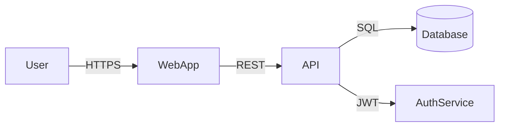

# model-threat

Produce a **STRIDE threat model** with attack surface enumeration, threat analysis, and prioritized mitigations.

## What is STRIDE?

STRIDE is a threat categorization framework where each letter represents a threat category:

| Letter | Threat | Violates |
|--------|--------|----------|
| **S** | Spoofing | Authentication |
| **T** | Tampering | Integrity |
| **R** | Repudiation | Non-repudiation |
| **I** | Information Disclosure | Confidentiality |
| **D** | Denial of Service | Availability |
| **E** | Elevation of Privilege | Authorization |

## Information gathering

From context, identify:
- **System description**: What is being built and how does it work?
- **Trust boundaries**: Where does data cross security boundaries (user→API, API→DB, service→service)?
- **Data classification**: What sensitive data does the system handle (PII, credentials, financial)?
- **Actors**: Who interacts with the system (anonymous users, authenticated users, admins, services)?
- **Integration points**: External systems, third-party APIs, infrastructure services?

Work with what's provided. If only a high-level description is given, scope the threat model to the design level and note where code-level analysis is needed.

## Output format

```markdown
# Threat Model: [System / Feature Name]

## Scope
**Date:** [date]
**System:** [brief description]
**Modeler:** [if known]
**In scope:** [components, features, or boundaries analyzed]
**Out of scope:** [explicitly excluded areas]

## System Overview
[1–2 paragraphs describing the system and how it works. Include a simple data flow diagram if possible.]



## Trust Boundaries

| Boundary | From | To | Trust Level |
|----------|------|----|-------------|
| Internet boundary | End user | Web application | Untrusted |
| Application boundary | Web app | API server | Semi-trusted |
| Data boundary | API | Database | Trusted |

## Attack Surface

| Entry Point | Protocol | Auth Required | Data Sensitivity |
|-------------|----------|---------------|-----------------|
| Login endpoint | HTTPS/REST | No | Credentials |
| User API | HTTPS/REST | Yes (JWT) | PII |
| Admin panel | HTTPS | Yes (MFA) | All data |
| Database | TCP | Yes (internal) | All data |

## STRIDE Threat Analysis

### Spoofing Threats

#### [S-01] [Threat Title]
- **Target:** [Which component or asset]
- **Description:** [How could an attacker impersonate a user or system?]
- **Impact:** [What could they do if successful?]
- **Likelihood:** High / Medium / Low
- **Risk:** Critical / High / Medium / Low
- **Mitigations:**
  - [Mitigation 1]
  - [Mitigation 2]
- **Status:** ✅ Mitigated / ⚠️ Partially mitigated / ❌ Not yet mitigated

[Repeat for additional spoofing threats]

### Tampering Threats
[Same structure]

### Repudiation Threats
[Same structure]

### Information Disclosure Threats
[Same structure]

### Denial of Service Threats
[Same structure]

### Elevation of Privilege Threats
[Same structure]

## Risk Summary

| ID | Threat | Category | Risk | Status |
|----|--------|----------|------|--------|
| S-01 | [Title] | Spoofing | High | ⚠️ Partial |
| T-01 | [Title] | Tampering | Medium | ✅ Mitigated |
| ... | | | | |

## Top Risks (Must Address)
1. [Highest risk finding with brief rationale]
2. [Second highest]
3. [Third highest]

## Recommended Controls

### Authentication & Authorization
- [Specific recommendation]

### Data Protection
- [Specific recommendation]

### Logging & Monitoring
- [Specific recommendation]

### Network & Infrastructure
- [Specific recommendation]

## Assumptions & Limitations
- [Assumptions made about the environment or configuration]
- [What would require a deeper audit to verify]
```

## Threat patterns by component type

**Web applications:**
- S: Session hijacking, CSRF, cookie theft
- T: Parameter tampering, request forgery
- I: Sensitive data in URLs/logs, verbose error messages
- E: Privilege escalation via role manipulation, JWT alg:none

**APIs:**
- S: JWT spoofing, API key theft, OAuth token leakage
- T: Mass assignment, HTTP method override
- I: Over-fetching (returning too many fields), introspection exposure
- D: Rate limit bypass, resource exhaustion

**Databases:**
- S: Credential theft, connection string exposure
- T: SQL injection, schema modification
- I: Unencrypted backups, column-level access control missing
- D: Query bombing, lock contention

**Third-party integrations:**
- S: Webhook spoofing (no signature validation)
- T: Response tampering via MITM
- I: PII sent to third parties without consent
- R: No logging of third-party calls for audit

## Calibration

- **Architecture description**: Threat model at design level; identify top risks for each component
- **Code provided**: Identify specific vulnerable patterns; reference line numbers
- **Pre-launch review**: Be exhaustive; cover all 6 STRIDE categories with multiple threats each
- **Quick assessment**: Focus on the top 5–10 highest-risk threats; don't enumerate exhaustively
