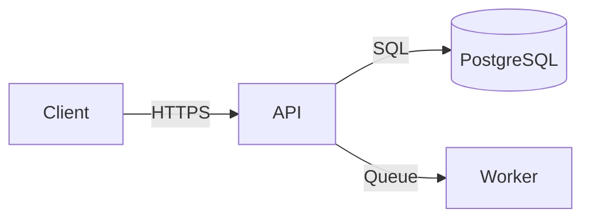

# writer-spec-tech

Produce a **comprehensive technical specification** combining functional requirements, non-functional requirements, architecture, API design, data model, and implementation guidance into one document.

## What makes a great tech spec

A tech spec is a contract between the person who understands what to build and the team who will build it. It should resolve all major ambiguities before implementation starts, so engineers can move confidently without constant interruptions for clarification. The best specs are specific, not vague — they say "user can reset password via email with a 1-hour expiring token" not "password reset functionality."

## Information gathering

From context, identify:
- **Feature or system**: What is being built?
- **Problem being solved**: Why is this needed?
- **Actors**: Who uses this? (users, admins, external systems)
- **Tech stack**: Languages, frameworks, databases already in use?
- **Scale**: Expected load, data volume, growth rate?
- **Integration points**: What systems does this touch?
- **Constraints**: Timeline, team, compliance requirements?

Ask once for anything critical that would change the architecture. Mark inferences with `[assumed]`.

## Output format

```markdown
# Technical Specification: [Feature / System Name]

## Document Info
**Status:** [Draft | In Review | Approved]
**Version:** 1.0
**Date:** [YYYY-MM-DD]
**Author(s):** [name(s) or team]
**Reviewer(s):** [name(s) or team]
**Target release:** [version or sprint]

---

## 1. Overview

### 1.1 Purpose
[1–2 sentences: what this spec defines and why]

### 1.2 Background
[2–4 paragraphs: the problem being solved, why now, what's been tried before. Link to relevant PRD or research.]

### 1.3 Goals
| Goal | Success Metric | Target |
|------|----------------|--------|
| [Goal] | [Measurable metric] | [Target value] |

### 1.4 Non-Goals
- [Explicitly out of scope]
- [Deferred to follow-up]

---

## 2. Functional Requirements

### 2.1 Actors
| Actor | Description |
|-------|-------------|
| [User type] | [Description and context] |

### 2.2 User Flows

**Flow: [Flow Name]**
1. [Step 1]
2. [Step 2]
3. [Step 3 with decision: if X then Y, else Z]

[Repeat for each major flow]

### 2.3 Functional Requirements

#### FR-001: [Requirement Title]
**Priority:** Must-have / Should-have / Could-have
**Actor:** [Who triggers this]
**Description:** [Precise, testable statement of what the system must do]
**Acceptance criteria:**
- [ ] [Testable criterion]
- [ ] [Another criterion]

[Repeat for each requirement]

### 2.4 Business Rules
- **BR-001:** [Rule that constrains behavior — e.g., "A user may not have more than 3 active sessions"]
- **BR-002:** [Another rule]

---

## 3. Non-Functional Requirements

| Category | Requirement | Target | Priority |
|----------|-------------|--------|----------|
| Performance | API response time (p95) | < 200ms | High |
| Availability | Uptime SLA | 99.9% | High |
| Scalability | Concurrent users | 10,000 | Medium |
| Security | Auth mechanism | JWT, 15-min TTL | High |
| Data retention | Log retention | 90 days | Medium |
| Accessibility | WCAG compliance | 2.1 AA | High |
| Observability | Trace coverage | 100% of requests | Medium |

---

## 4. System Architecture

### 4.1 Architecture Overview
[2–3 paragraphs describing the high-level approach and key architectural decisions]



### 4.2 Component Responsibilities

| Component | Technology | Responsibility |
|-----------|------------|----------------|
| [Component] | [Stack] | [What it does] |

### 4.3 Key Design Decisions

**Decision: [Title]**
- Chosen: [What]
- Rationale: [Why]
- Trade-off: [What was sacrificed]

---

## 5. API Design

### 5.1 New Endpoints

#### `[METHOD] [/path]`
**Purpose:** [One sentence]
**Auth:** Required / None

**Request:**
```json
{ "field": "type" }
```

**Response (200):**
```json
{ "id": "string", "result": "value" }
```

**Errors:**
| Status | Condition |
|--------|-----------|
| 400 | [When] |
| 401 | [When] |

### 5.2 Modified Endpoints
[List endpoints with changes and migration notes]

### 5.3 Events / Messages *(if applicable)*
[Async events published or consumed]

---

## 6. Data Model

### 6.1 New Tables / Collections

```sql
CREATE TABLE [table_name] (
  id          UUID PRIMARY KEY DEFAULT gen_random_uuid(),
  [field]     [TYPE] NOT NULL,
  created_at  TIMESTAMPTZ NOT NULL DEFAULT now(),
  updated_at  TIMESTAMPTZ NOT NULL DEFAULT now()
);
```

### 6.2 Schema Changes
[Existing tables being modified — column additions, index changes]

### 6.3 Migration Plan
[How to migrate from current state to new schema — link to migration script]

---

## 7. Security Considerations

- **Authentication:** [Mechanism and implementation]
- **Authorization:** [Who can do what, RBAC rules]
- **Data protection:** [Encryption at rest/in transit, PII handling]
- **Input validation:** [Key validation rules]
- **Rate limiting:** [Thresholds for sensitive endpoints]
- **Audit logging:** [What actions are logged and where]

---

## 8. Observability

| Signal | What to instrument | Tooling |
|--------|-------------------|---------|
| Metrics | [Key metrics — request rate, error rate, latency] | [Prometheus / Datadog] |
| Logs | [What to log — request, errors, audit events] | [Loki / CloudWatch] |
| Traces | [Which services to trace through] | [Jaeger / Tempo] |
| Alerts | [Key alert conditions] | [PagerDuty / Grafana] |

---

## 9. Testing Strategy

| Level | Scope | Tools | Coverage Target |
|-------|-------|-------|----------------|
| Unit | [Business logic] | [Tool] | ≥ 85% |
| Integration | [Service + DB] | [Tool] | Key flows |
| E2E | [Critical user paths] | [Tool] | Happy path + main errors |

---

## 10. Implementation Plan

### Phase 1: [Name] (Est: [N] days)
- [ ] [Task]
- [ ] [Task]

### Phase 2: [Name] (Est: [N] days)
- [ ] [Task]

### Dependencies
| Dependency | Team / System | Needed by |
|------------|---------------|-----------|
| [What] | [Who owns it] | Phase [N] |

---

## 11. Open Questions

| # | Question | Owner | Due | Status |
|---|----------|-------|-----|--------|
| 1 | [Question] | [Name] | [date] | Open |

---

## 12. Appendix

- [Glossary of domain terms]
- [Links to related specs, ADRs, designs]
- [Reference architecture or benchmarks]
```

## Depth calibration

- **Simple feature** (< 1 week of work): Focus on sections 2, 5, 6, 10. Combine sections where thin.
- **Major feature** (1–4 weeks): Full document; all sections required.
- **New system**: Emphasize sections 4, 6, 7, 8. Architecture decisions deserve extra depth.
- **Existing system change**: Emphasize what's changing, migration plan, backward compatibility.

## Writing guidance

- **Be specific**: "Token expires after 15 minutes" not "tokens expire quickly"
- **Make it testable**: Each FR should translate directly to test cases
- **State the invariants**: What must always be true? (e.g., "users can never see other tenants' data")
- **Document the omissions**: If auth is out of scope, say why
- **Use `[assumed]`**: Mark every inference so reviewers can verify
