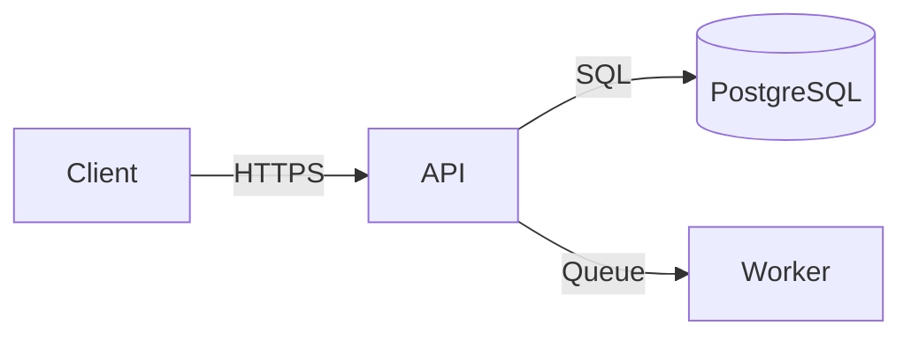

# Technical Specification: [Feature / System Name]

## Document Info

**Status:** [Draft | In Review | Approved]
**Version:** 1.0
**Date:** [YYYY-MM-DD]
**Author(s):** [name(s) or team]
**Reviewer(s):** [name(s) or team]
**Target release:** [version or sprint]

---

## 1. Overview

### 1.1 Purpose

[1–2 sentences: what this spec defines and why]

### 1.2 Background

[2–4 paragraphs: the problem, why now, what's been tried before. Link to relevant PRD or research.]

### 1.3 Goals

| Goal | Success Metric | Target |
| ---- | -------------- | ------ |

### 1.4 Non-Goals

- [Explicitly out of scope]

---

## 2. Functional Requirements

### 2.1 Actors

| Actor | Description |
| ----- | ----------- |

### 2.2 User Flows

**Flow: [Flow Name]**

1. [Step 1]
2. [Step 2]
3. [Step 3 with decision: if X then Y, else Z]

### 2.3 Functional Requirements

#### FR-001: [Requirement Title]

**Priority:** Must-have / Should-have / Could-have
**Actor:** [Who triggers this]
**Description:** [Precise, testable statement — "The system shall…"]
**Acceptance criteria:**

- [ ] [Testable criterion]

### 2.4 Business Rules

- **BR-001:** [Rule — e.g., "A user may not have more than 3 active sessions"]

---

## 3. Non-Functional Requirements

| Category     | Requirement             | Target          | Priority |
| ------------ | ----------------------- | --------------- | -------- |
| Performance  | API response time (p95) | < 200ms         | High     |
| Availability | Uptime SLA              | 99.9%           | High     |
| Scalability  | Concurrent users        | 10,000          | Medium   |
| Security     | Auth mechanism          | JWT, 15-min TTL | High     |

---

## 4. System Architecture

### 4.1 Architecture Overview

[2–3 paragraphs describing the high-level approach and key decisions]



### 4.2 Component Responsibilities

| Component | Technology | Responsibility |
| --------- | ---------- | -------------- |

### 4.3 Key Design Decisions

**Decision: [Title]**

- Chosen: [What]
- Rationale: [Why]
- Trade-off: [What was sacrificed]

---

## 5. API Design

### 5.1 New Endpoints

#### `[METHOD] [/path]`

**Purpose:** [One sentence]
**Auth:** Required / None

**Request:**

```json
{ "field": "type" }
```

**Response (200):**

```json
{ "id": "string", "result": "value" }
```

**Errors:**

| Status | Condition |
| ------ | --------- |

### 5.2 Modified Endpoints

[List endpoints with changes and migration notes]

---

## 6. Data Model

### 6.1 New Tables / Collections

```sql
CREATE TABLE [table_name] (
  id         UUID PRIMARY KEY DEFAULT gen_random_uuid(),
  [field]    [TYPE] NOT NULL,
  created_at TIMESTAMPTZ NOT NULL DEFAULT now(),
  updated_at TIMESTAMPTZ NOT NULL DEFAULT now()
);
```

### 6.2 Schema Changes

[Existing tables being modified]

### 6.3 Migration Plan

[How to migrate from current state to new schema]

---

## 7. Security Considerations

- **Authentication:** [Mechanism]
- **Authorization:** [RBAC rules]
- **Data protection:** [Encryption, PII handling]
- **Rate limiting:** [Thresholds]
- **Audit logging:** [What is logged and where]

---

## 8. Observability

| Signal  | What to instrument                  | Tooling |
| ------- | ----------------------------------- | ------- |
| Metrics | [request rate, error rate, latency] |         |
| Logs    | [request, errors, audit events]     |         |
| Traces  | [which services]                    |         |
| Alerts  | [key conditions]                    |         |

---

## 9. Testing Strategy

| Level       | Scope               | Tools | Coverage Target          |
| ----------- | ------------------- | ----- | ------------------------ |
| Unit        | Business logic      |       | ≥ 85%                    |
| Integration | Service + DB        |       | Key flows                |
| E2E         | Critical user paths |       | Happy path + main errors |

---

## 10. Implementation Plan

### Phase 1: [Name] (Est: [N] days)

- [ ] [Task]

### Dependencies

| Dependency | Team / System | Needed by |
| ---------- | ------------- | --------- |

---

## 11. Open Questions

| #   | Question | Owner | Due | Status |
| --- | -------- | ----- | --- | ------ |

---

## 12. Appendix

- [Glossary, links to related specs, ADRs, designs]
