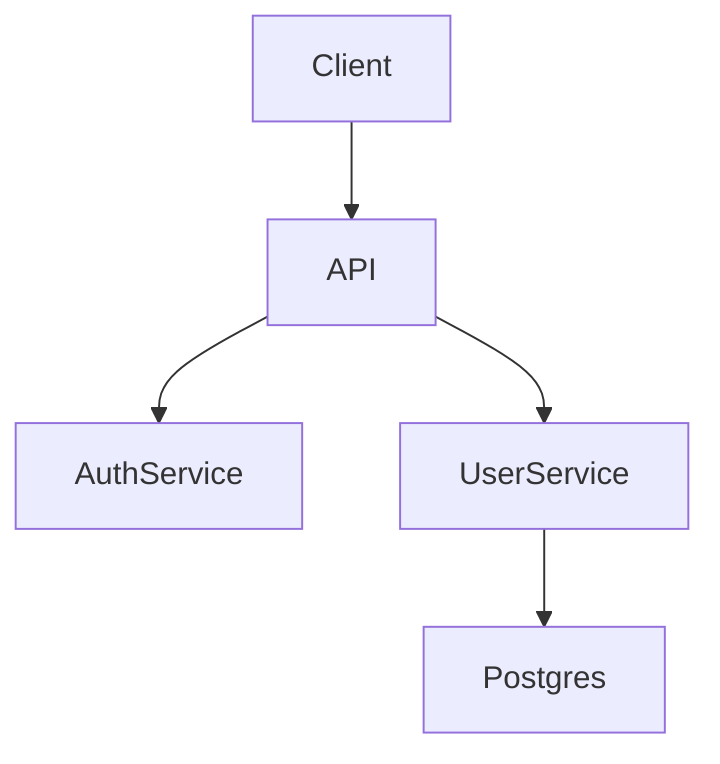

# Agent Playbook

> **Version:** 0.0.1
> **Status:** Draft
> **Purpose:** A portable, tool-agnostic playbook for structuring LLM agent context, memory, rules, and documentation inside any software project.

---

## Philosophy

Agent behavior is code. It should be versioned, reviewed, modular, and readable by both humans and machines. The `.agent/` folder is the single source of truth for everything an LLM agent needs to operate within a project — permissions, instructions, skills, memory, commands, and documentation artifacts.

### Core Principles

- **Co-location** — Agent files live alongside the code they govern. No external dashboards required.
- **Modularity** — Each concern (rules, skills, memory, docs) lives in its own folder and can be adopted incrementally.
- **Composability** — Subagents, rules, and skills can be mixed and matched across projects.
- **Portability** — The playbook is tool-agnostic. It should work with any LLM agent runtime (Claude, Cursor, GPT, custom).
- **Progressive disclosure** — Start with just a `README.md`. Add folders only when needed.

---

## Folder Structure

```text
project-root/
│
├── docs/                          # Project documentation artifacts (task-scoped)
│   ├── <task-name>/               # One folder per task, feature, or epic
│   │   ├── PRD.md
│   │   ├── SPEC.md
│   │   ├── ARCHITECTURE.md
│   │   ├── DESIGN.md
│   │   └── TASKS.md
│   └── <another-task>/
│       └── ...
│
└── .agent/
    ├── README.md              # Primary instruction file + table of contents
    ├── settings.json          # Permissions, preferences, and runtime config
    │
    ├── rules/                 # Modular instruction files
    │   └── <rule-name>/
    │       └── RULE.md
    │
    ├── skills/                # Auto-invoking workflows (trigger → action)
    │   └── <skill-name>/
    │       └── SKILL.md
    │
    ├── commands/              # Custom slash commands
    │   └── <command-name>/
    │       └── COMMAND.md
    │
    ├── agents/                # Subagent personas
    │   └── <agent-persona>/
    │       └── AGENT.md
    │
    └── memory/                # Persistent agent memory
        ├── MEMORY.md          # Long-term memory. Durable facts, preferences, and decisions
        └── YYYY-MM-DD.md      # Daily notes. Running context and observations
```

---

## File & Folder Reference

---

### `README.md` — Primary Instruction File

The agent's entry point. Every runtime MUST load this file first. It serves two roles:

1. **System prompt** — High-level instructions, persona, tone, and behavioral defaults.
2. **Table of contents** — An index of all active agent files so the runtime knows what else to load.

#### Schema

```markdown
# Agent Instructions

## Identity

[Who this agent is and what it does]

## Behavior

[How it should act, tone, defaults]

## Loaded Context

<!-- The runtime uses this section to discover and load other files -->

| File                                  | Purpose              | Auto-load |
| ------------------------------------- | -------------------- | --------- |
| rules/code-style/RULE.md              | Coding conventions   | yes       |
| rules/security/RULE.md                | Security constraints | yes       |
| commands/review/COMMAND.md            | /review command      | on-demand |
| memory/MEMORY.md                      | Long-term memory     | yes       |
| ../docs/auth-redesign/ARCHITECTURE.md | Task architecture    | on-demand |
```

#### Rules

- Must always be present in `.agent/`.
- Must contain a `## Loaded Context` table listing all active files.
- `Auto-load: yes` files are injected into every session. `on-demand` files are loaded only when relevant or explicitly invoked.
- Keep it concise — this is a prompt, not a novel.

---

### `settings.json` — Permissions & Preferences

Machine-readable configuration controlling runtime behavior, permissions, and tool access.

#### Schema

```json
{
  "version": "1.0",
  "agent": {
    "name": "ProjectBot",
    "model": "claude-sonnet-4",
    "temperature": 0.3
  },
  "permissions": {
    "read": ["src/**", "docs/**", ".agent/**"],
    "write": ["src/**", "docs/**", ".agent/memory/**"],
    "deny": ["**/.env", "**/secrets/**", "**/*.key"],
    "shell": {
      "allow": ["npm test", "npm run lint", "git status", "git diff"],
      "deny": ["rm -rf", "git push --force", "curl *"]
    }
  },
  "memory": {
    "auto_save": true,
    "max_entries": 500
  },
  "tools": {
    "web_search": false,
    "code_execution": true,
    "file_write": true
  },
  "context_window": {
    "auto_load_rules": true,
    "auto_load_memory": true,
    "max_docs_tokens": 8000
  }
}
```

#### Rules

- Must be valid JSON or YAML (`.yaml` extension also accepted).
- `permissions.deny` always takes precedence over `permissions.read` or `permissions.write`.
- Shell commands in `allow` are exact-match prefixes unless a glob `*` is used.

---

### `rules/` — Modular Instruction Files

Granular, composable instruction files. Each file governs a single concern. Rules are injected into the context window based on relevance or the `Auto-load` setting in `README.md`.

#### Naming Convention

```text
rules/<name>/RULE.md
```

Examples: `rules/code-style/RULE.md`, `rules/security/RULE.md`, `rules/testing/RULE.md`, `rules/git-workflow/RULE.md`, `rules/api-conventions/RULE.md`

#### File Schema

````markdown
---
name: Code Style
description: Enforces project coding conventions
applies_to: ["**/*.ts", "**/*.tsx"]
priority: high
---

# Code Style Rules

- Use 2-space indentation
- Prefer `const` over `let`; never use `var`
- All exported functions must have JSDoc comments
  ...
````

#### Rules

- Front matter is optional but recommended for runtime filtering.
- `applies_to` globs tell the runtime when to auto-inject this rule (e.g., only when editing `.ts` files).
- `priority` helps runtimes resolve conflicts between rules. Values: `low | medium | high | critical`.
- Rules should be written as direct imperatives, not suggestions.

---

### `skills/` — Auto-Invoking Workflows

Skills are pre-defined workflows that trigger automatically based on context signals — a file being created, a test failing, a commit being made. They are the agent's "reflexes."

#### Naming Convention

```text
skills/<name>/SKILL.md
```

Examples: `skills/on-new-file/SKILL.md`, `skills/on-test-fail/SKILL.md`, `skills/on-pr-open/SKILL.md`, `skills/on-commit/SKILL.md`

#### File Schema

````markdown
---
name: On New File
trigger:
  event: file_created
  pattern: "src/**/*.ts"
description: Auto-generates a matching test file when a new TypeScript file is created
---

# Skill: On New File

## Trigger

Whenever a new `.ts` file is created in `src/`.

## Workflow

1. Inspect the new file and identify exported functions/classes.
2. Check if a corresponding `.test.ts` file exists in `src/__tests__/`.
3. If not, generate a scaffold test file using the project's test conventions (see `rules/testing/RULE.md`).
4. Notify the user: "Created test scaffold at `[path]`."

## Output

- Creates: `src/__tests__/<filename>.test.ts`
- Notifies: Yes
````

#### Rules

- Skills must define a `trigger` — either an `event` or a `pattern` (or both).
- Skills should be idempotent — running them twice should not cause harm.
- Skills may reference other files (rules, docs) in their workflow steps.
- A skill that has no clear trigger should be a `command` instead.

---

### `commands/` — Custom Slash Commands

Explicit, user-invoked operations exposed as slash commands (e.g., `/review`, `/scaffold`).

#### Naming Convention

```text
commands/<name>/COMMAND.md
```

Examples: `commands/review/COMMAND.md`, `commands/scaffold/COMMAND.md`, `commands/deploy-check/COMMAND.md`, `commands/summarize/COMMAND.md`

#### File Schema

````markdown
---
name: review
alias: ["/review", "/cr"]
description: Performs a structured code review on staged or specified files
args:
  - name: target
    type: string
    required: false
    default: "staged"
    description: File path, glob, or 'staged' for git-staged files
---

# Command: /review

## Usage

```text
/review [target]
/review src/auth/login.ts
/review staged
```

## Behavior
1. Load `rules/code-style/RULE.md` and `rules/security/RULE.md`.
2. Diff the target against `main` (or review the full file if untracked).
3. Produce a structured review in the following format:

### Review Format
**Summary:** [One-line verdict]

**Issues:**
| Severity | Line | Description |
|----------|------|-------------|
| 🔴 Critical | 42 | SQL injection risk — user input not sanitized |
| 🟡 Warning | 88 | Missing null check before `.data` access |
| 🔵 Info | 12 | Consider extracting magic number `3600` to a constant |

**Suggestion:** [Optional refactor idea]
````

#### Rules

- Command names must be lowercase and hyphenated.
- `alias` lists all valid invocation strings.
- `args` defines accepted parameters — the runtime uses this for autocomplete and validation.
- Commands should produce deterministic, structured output.

---

### `agents/` — Subagent Personas

Specialized agent personas that can be invoked for specific tasks. Each subagent has its own identity, capabilities, and behavioral constraints.

#### Naming Convention

```
agents/<name>/AGENT.md
```

Examples: `agents/reviewer/AGENT.md`, `agents/architect/AGENT.md`, `agents/debugger/AGENT.md`, `agents/writer/AGENT.md`, `agents/security-auditor/AGENT.md`

#### File Schema

````markdown
---
name: Architect
invoke: "@architect"
description: Senior software architect focused on system design and technical decisions
inherits: ["rules/general/RULE.md"]
overrides:
  temperature: 0.2
  tools: ["file_read", "web_search"]
---

# Subagent: @architect

## Identity

You are a senior software architect with 15 years of experience designing scalable distributed systems. You are opinionated, precise, and always consider long-term maintainability over short-term convenience.

## Responsibilities

- Evaluate architectural decisions and trade-offs
- Produce or review `docs/<task>/ARCHITECTURE.md`
- Advise on technology choices with explicit rationale
- Flag designs that will not scale or will create debt

## Behavioral Constraints

- Never write implementation code — only design, diagrams, and guidance
- Always provide at least two alternatives before recommending one
- Cite `docs/<task>/ARCHITECTURE.md` when context is available
- Use ADR (Architecture Decision Record) format for major decisions

## Output Format

Use structured Mermaid diagrams for system visualizations.
````

#### Rules

- `invoke` defines the `@mention` syntax to activate the subagent.
- `inherits` lists rule files that carry over from the parent agent.
- `overrides` allows subagents to override top-level `settings.json` values (e.g., lower temperature for more deterministic output).
- Subagents should not have broader permissions than the parent agent.

---

### `memory/` — Agent Memory

Persistent storage of facts, decisions, entities, and context that should survive across sessions.

#### Recommended Files

| File             | Purpose                                                     |
| ---------------- | ----------------------------------------------------------- |
| `MEMORY.md`      | Long-term memory. Durable facts, preferences, and decisions |
| `YYYY-MM-DD.md`  | Daily notes. Running context and observations               |

#### `MEMORY.md` Schema

```markdown
# Memory

## Facts

- **Project uses Postgres** — Primary database since 2025-01
- **@alex is lead engineer** — Owns payment module

## Preferences

- **Code review** — Prefers concise PR reviews with clear action items
- **Testing** — Requires 80% coverage minimum

## Decisions

### [2025-05-01] Use Postgres over MongoDB

**Context:** Evaluating database for user profile storage.
**Decision:** Chose Postgres for its relational integrity.
**Revisit if:** Need to store unstructured event data at scale.
```

#### `YYYY-MM-DD.md` Schema

```markdown
# 2025-05-01

## Context

Working on user authentication feature.

## Observations

- Found that JWT refresh token rotation is not implemented
- AuthService currently lacks token blacklist

## Next Steps

- [ ] Implement JWT refresh token rotation
- [ ] Add rate limiting to login endpoint
```

#### Rules

- Memory files are append-only by convention. Old entries should not be deleted, only superseded.
- Use `MEMORY.md` for durable facts, preferences, and decisions that should persist long-term.
- Create `YYYY-MM-DD.md` files for daily notes with running context and observations.
- Memory should be treated as low-confidence context — the agent must not treat it as ground truth without verification.
- Sensitive data (tokens, passwords, PII) must never be written to memory files.

---

### `docs/` — Project Documentation Artifacts

Lives at the **project root**, not inside `.agent/`. Documentation is organized by task, feature, or epic — each gets its own subfolder. All files within a task folder are optional and created only when needed.

#### Structure

```
docs/
└── <task-name>/
    ├── PRD.md
    ├── SPEC.md
    ├── ARCHITECTURE.md
    ├── DESIGN.md
    └── TASKS.md
```

`<task-name>` should be a short, lowercase, hyphenated identifier that matches the work it describes — a feature name, epic, ticket ID, or initiative slug.

```
docs/
├── user-authentication/
│   ├── PRD.md
│   ├── SPEC.md
│   └── ARCHITECTURE.md
├── payment-integration/
│   ├── PRD.md
│   └── TASKS.md
└── api-v2-migration/
    ├── SPEC.md
    ├── ARCHITECTURE.md
    └── DESIGN.md
```

#### File Inventory

| File              | Purpose                              | When to create                    |
| ----------------- | ------------------------------------ | --------------------------------- |
| `PRD.md`          | Product Requirements Document        | At task inception                 |
| `SPEC.md`         | Functional & technical specification | Before implementation begins      |
| `ARCHITECTURE.md` | System design, diagrams, ADRs        | When technical decisions are made |
| `DESIGN.md`       | UI/UX decisions, component system    | For frontend/product work         |
| `TASKS.md`        | Actionable task list, backlog        | During active development         |
| `CHANGELOG.md`    | Human-readable history of changes    | For versioned releases            |
| `GLOSSARY.md`     | Domain-specific terminology          | For complex domains               |

#### Naming Convention

```
docs/<task-name>/<document>.md
```

- `<task-name>` — lowercase, hyphenated. Examples: `user-auth`, `payment-v2`, `PROJ-142`, `onboarding-flow`
- `<document>` — uppercase, hyphenated. Examples: `PRD`, `SPEC`, `ARCHITECTURE`, `DESIGN`, `TASKS`, `CHANGELOG`, `GLOSSARY`

#### `TASKS.md` Schema

```markdown
# Tasks — <task-name>

## In Progress

- [ ] #12 Implement JWT refresh token rotation (@alex)

## Backlog

- [ ] #13 Add rate limiting to `/api/auth/login`
- [ ] #14 Write integration tests for UserService

## Done

- [x] #11 Set up Postgres schema migrations
- [x] #10 Configure CI pipeline
```

#### `ARCHITECTURE.md` Schema

````markdown
# Architecture — <task-name>

## Overview

[1-2 paragraph description of the system]

## System Diagram


````

## Architecture Decision Records

### ADR-001: Use JWT for authentication

**Date:** 2025-05-01
**Status:** Accepted
**Context:** Need stateless, scalable auth across multiple services.
**Decision:** Use short-lived JWTs (15min) with refresh token rotation.
**Consequences:** Must implement token blacklist for revocation.

#### Rules

- `docs/` is **not** inside `.agent/`. It is a first-class project folder at the root.
- Every task folder must have at least one document to justify its existence.
- The agent references task docs using root-relative paths: `docs/user-auth/spec.md`.
- Cross-task references are allowed but should be explicit: `See docs/api-v2-migration/architecture.md`.
- Task folders should not be deleted when work completes — they serve as a historical record.

---

## Adoption Guide

### Minimal Setup (< 5 min)

```
.agent/
└── README.md
```

Start with just a `README.md`. Write your agent instructions. Add folders as needs emerge.

---

### Playbook Setup

```
.agent/
├── README.md
├── settings.json
├── rules/
│ ├── general/
│ │ └── RULE.md
│ └── code-style/
│     └── RULE.md
└── memory/
    └── MEMORY.md
```

---

### Full Setup

Add `skills/`, `commands/`, `agents/`, and `docs/<task>/` as the project matures.

---

## Runtime Expectations

A compliant runtime MUST:

1. **Always load** `.agent/README.md` at session start.
2. **Load `settings.json`** and enforce `permissions.deny` rules before any file operation.
3. **Auto-inject** all files marked `Auto-load: yes` in `README.md`.
4. **Trigger skills** whose `trigger.event` or `trigger.pattern` matches the current context.
5. **Register commands** from `commands/` and expose them via the invocation interface.
6. **Respect subagent boundaries** — a subagent must not exceed the parent agent's permissions.

A compliant runtime SHOULD:

- Warn when a referenced file in `README.md` does not exist.
- Surface memory from `memory/` as low-confidence context.
- Prompt the user before executing any shell command.
- Validate `settings.json` against the schema and report errors.

---

## Versioning & Compatibility

- This playbook follows [Semantic Versioning](https://semver.org/).
- The `settings.json` `version` field must match the major version of the playbook in use.
- Breaking changes to the playbook require a major version bump.

---

## Security Considerations

- `.agent/` should be committed to version control — it is project configuration, not secrets.
- **Never** store API keys, tokens, or credentials in any `.agent/` file.
- `settings.json` `permissions.deny` should always include `**/.env` and `**/secrets/**`.
- Memory files must be reviewed periodically to ensure no sensitive data has been inadvertently captured.
- Subagent personas should have the minimum permissions necessary for their role.

---

## Reference Implementation

This repository uses itself as the reference implementation. The `.agent/` folder at the root of this repo is a real, working example of the playbook applied to its own development — governing how agents should assist with writing, reviewing, and evolving the spec itself.

```
agent.md/ ← this repo
│
├── README.md
├── index.md
├── PLAYBOOK.md
├── LICENSE
│
├── docs/
│ └── <task>/
│ └── \*.md
│
└── .agent/ ← reference implementation
├── README.md
├── settings.json
├── rules/
│ ├── writing-style/
│ │ └── RULE.md
│ └── contribution/
│     └── RULE.md
├── skills/
│ └── on-new-example/
│     └── SKILL.md
├── commands/
│ └── validate/
│     └── COMMAND.md
├── agents/
│ └── spec-reviewer/
│     └── AGENT.md
└── memory/
    └── MEMORY.md
```

Browse the [`.agent/`](./.agent) folder directly to see each file type as a working example.

---

## Example: Real Project Layout

```
my-saas-app/
├── src/
├── tests/
├── package.json
│
├── docs/ # Task-scoped documentation
│ ├── user-authentication/
│ │ ├── PRD.md
│ │ ├── SPEC.md
│ │ └── ARCHITECTURE.md
│ └── payment-integration/
│ ├── PRD.md
│ └── TASKS.md
│
└── .agent/
├── README.md
├── settings.json
├── rules/
│ ├── code-style/ # TypeScript conventions
│ │ └── RULE.md
│ ├── testing/ # Test coverage requirements
│ │ └── RULE.md
│ └── security/ # OWASP top-10 awareness
│     └── RULE.md
├── skills/
│ ├── on-new-file/ # Auto-scaffold test files
│ │ └── SKILL.md
│ └── on-test-fail/ # Diagnose CI failures
│     └── SKILL.md
├── commands/
│ ├── review/ # /review — structured code review
│ │ └── COMMAND.md
│ └── scaffold/ # /scaffold — generate boilerplate
│     └── COMMAND.md
├── agents/
│ ├── architect/ # @architect — system design advisor
│ │ └── AGENT.md
│ └── security-auditor/ # @security — OWASP-focused review
│     └── AGENT.md
└── memory/
    └── MEMORY.md
```

---

*This playbook is intentionally tool-agnostic. Implementations may extend it with runtime-specific features provided they do not break compatibility with this core specification.*
