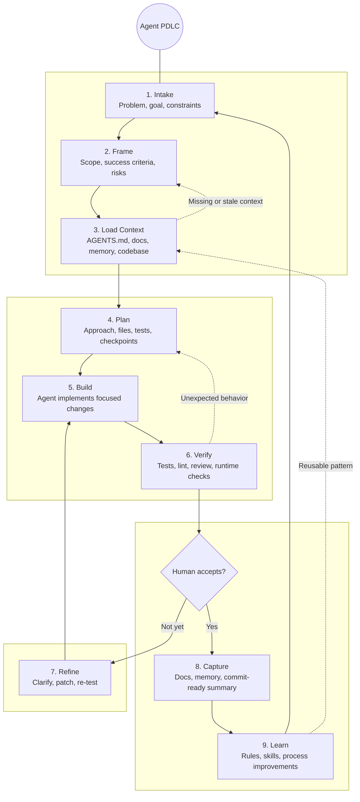

# Agent PDLC

This diagram adapts a product development lifecycle for work done with an AI coding agent. The loop keeps humans responsible for intent, tradeoffs, and acceptance while letting the agent accelerate discovery, implementation, verification, and documentation.

## Stage Responsibilities

| Stage | Human responsibility | Agent responsibility | Typical artifacts |
| --- | --- | --- | --- |
| Intake | State the desired outcome and constraints. | Restate the task, identify ambiguity, and avoid premature implementation. | Prompt, issue, request notes |
| Frame | Decide what matters and what is out of scope. | Translate intent into acceptance criteria, risks, and an execution boundary. | PRD, spec, checklist |
| Load Context | Confirm which sources are authoritative. | Read `AGENTS.md`, relevant docs, memory, and code before acting. | `.agents/`, `docs/`, source files |
| Plan | Approve or redirect meaningful tradeoffs. | Choose a conservative implementation path and verification strategy. | Task plan, file map |
| Build | Stay available for product or design calls. | Make scoped edits that follow repository conventions. | Code, docs, config |
| Verify | Judge whether the result satisfies the real need. | Run tests, inspect output, review diffs, and fix regressions. | Test output, screenshots, review notes |
| Refine | Clarify changed intent or reject weak tradeoffs. | Iterate without discarding unrelated user work. | Patches, updated tests |
| Capture | Decide what needs durable memory. | Update docs, memory, and final implementation notes. | `README`, `SPEC`, `.agents/memory` |
| Learn | Decide which lessons should affect future work. | Propose rules, skills, or process updates when a pattern repeats. | Rules, skills, playbook updates |

## Operating Principles

The lifecycle is intentionally recursive. Verification can send work back to planning, missing context can send it back to framing, and repeated lessons can become new rules or skills. The useful part is not the sequence itself; it is the habit of making intent, context, verification, and learning explicit before the next request arrives and everyone pretends memory is a strategy.
